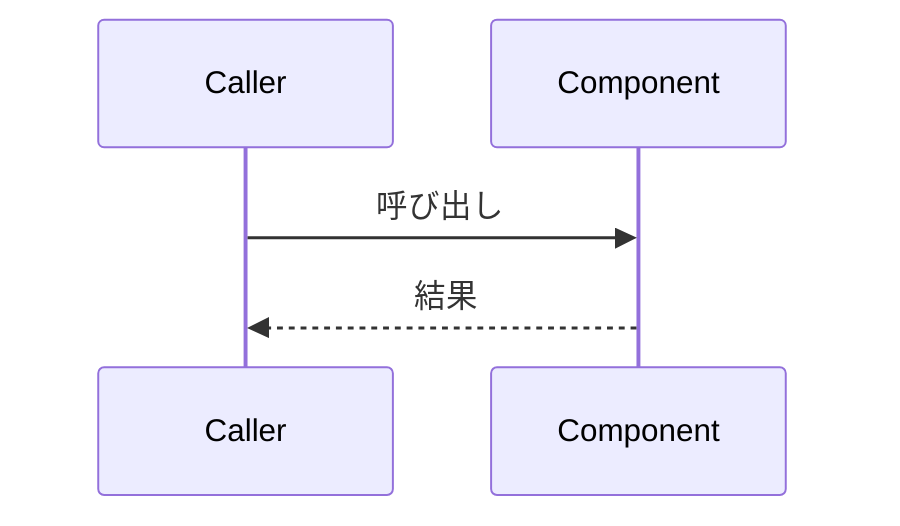

# [機能名] — アーキテクチャ設計書

## Document Status

| Item | Value |
|---|---|
| Status | `draft` |
| Created | YYYY-MM-DD |
| Review date | - |
| Reviewer | - |
| Comments | - |

関連ドキュメント: [要件定義書](01_requirements.md)

## 1. 設計の全体像

### 1.1 設計原則

- (例: YAGNI / DRY / 外部依存の最小化 / fail-closed — [CLAUDE.md](../../../CLAUDE.md#key-design-patterns) 参照。この機能固有の原則があれば追記)

### 1.2 概念モデル


### 1.3 要件との対応

(01_requirements.md の F-XXX / AC-NN が、本設計のどの構成要素で満たされるかを一覧化する)

## 2. システム構成

### 2.1 コンポーネント配置

(コンポーネント配置を Mermaid flowchart で示す。[mermaid_reference.md](../../dev/developer_guide/mermaid_reference.md) の配色規則に従う)

### 2.2 データフロー

(主要な処理の流れを Mermaid sequence diagram で示す)



## 3. コンポーネント設計

### 3.1 データ構造・インターフェース

(型定義・インターフェースのみを高レベルに示す。実装コードは書かない)

```go
// 例
type PostFilter interface {
    ShouldDelete(post Post, now time.Time) bool
}
```

### 3.2 判定・処理ロジック

(AC-NN に対応させながら、主要なロジックの設計を記述する。関連する AC 番号を見出しに含めると
実装計画書・テストとの追跡が容易になる: 例 `### 3.2 削除対象の判定ロジック（AC-01〜AC-03）`)

### 3.3 コンポーネントの責務（新規・変更ファイル一覧）

- **[コンポーネント名]（新規/変更）**: [責務の説明]

## 4. エラーハンドリング設計

- (エラー型の定義方針。インターフェースのみ)
- (エラーメッセージの設計パターン)

## 5. セキュリティ考慮事項

(この機能固有のセキュリティ設計。プロジェクト共通のリスクは [セキュリティ設計](../../design/security.md) を参照。
[_context.md](../../../.claude/commands/_context.md) の Conditional-guide trigger に該当する場合は、専用の設計ノートを追加すること)

### 5.1 副作用契約

(dry-run / 実行時で挙動が変わる場合、その境界を明記する)

### 5.2 脅威モデル

(この機能が新たに持ち込みうる攻撃ベクトルと対策)

### 5.3 検出限界

(意図的に対応しない攻撃・エッジケースがあれば、理由とともに明記する)

## 6. 処理フロー詳細

(主要な処理フローを sequence/flowchart で詳細化)

## 7. テスト戦略

### 7.1 単体テスト

[方針]

### 7.2 統合テスト

[方針]

### 7.3 セキュリティ・回帰テスト

[方針。既存挙動を保存する箇所があれば差分テストの方針も記載]

## 8. 実装優先順位

1. [フェーズ1: 内容]
2. [フェーズ2: 内容]

## 9. 将来拡張性

(将来的な機能拡張を見据えた設計上の考慮事項があれば記載。YAGNIに反しない範囲で)

## 付録: 決定履歴

(設計検討中に決定・却下した代替案があれば、判断根拠とともに記録する。任意セクション)
